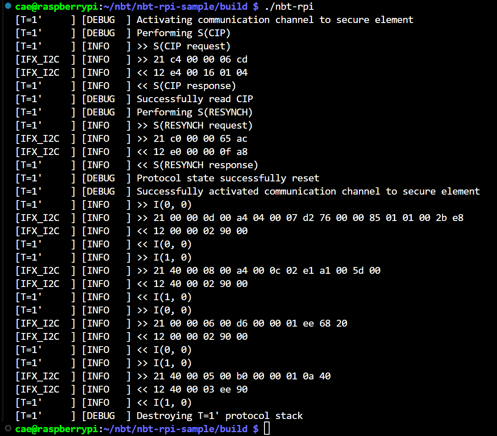

<!--
SPDX-FileCopyrightText: Copyright (c) Copyright (c) 2024-2025 Infineon Technologies AG
SPDX-License-Identifier: MIT
-->

# OPTIGA™ Authenticate NBT Port for Raspberry Pi

This guide provides a step-by-step process for porting the [OPTIGA™ Authenticate NBT Host Library for C](https://github.com/Infineon/optiga-nbt-lib-c) to Raspberry Pi OS, utilizing the I2C interface.

## Overview

The guide outlines the process of setting up the development environment, configuring the Raspberry Pi and adapting the host code for compatibility.

Refer to the [OPTIGA&trade; Authenticate NBT Host Library for C: User guide](https://github.com/Infineon/optiga-nbt-lib-c/blob/main/docs/userguide.md) repository to understand the features and functionality of the host library, including an architecture overview and descriptions of the host library's components.

## Getting started

This section contains information on how to setup and interface the OPTIGA™ Authenticate NBT with a Raspberry Pi.

### Hardware requirements

- Raspberry Pi 4/5
- [OPTIGA&trade; Authenticate NBT Development Shield](https://www.infineon.com/cms/en/product/evaluation-boards/optiga-auth-nbt-shield/)

The following table shows the mapping of the OPTIGA&trade; Authenticate NBT Development Shield's pins to Raspberry Pi.

| OPTIGA&trade; Authenticate NBT Development Shield | Raspberry Pi |          Function          |
| ------------------------------------------------- | ------------ | -------------------------- |
| SDA                                               | GPIO 2       | I2C data                   |
| SCL                                               | GPIO 3       | I2C clock                  |
| IRQ                                               | NC           | Interrupt                  |
| 3V3                                               | 3V3          | Power and pad supply (3V3) |
| GND                                               | GND          | Common ground reference    |

The Raspberry Pi's pins need to be connected to the OPTIGA&trade; Authenticate NBT Development Shield as shown in Table 1.


Since the pins of the Shield are compatible with the Raspberry Pi's GPIO pinout, the shield may also be directly attached to the Raspberry Pi as seen in the image above.

### Modify configuration file

To change the I2C speed and baudrate on a Raspberry Pi, you need to modify the `config.txt` file. The I2C interface on the Raspberry Pi can be configured to operate at different speeds by setting appropriate parameters in this file.

1. Open the `config.txt` file located in the `/boot` directory:

    ```sh
    sudo nano /boot/config.txt
    ```

2. To set the I2C speed, add or modify the `dtparam` entry for the I2C bus. The parameter `i2c_arm_baudrate` sets the baud rate for the ARM I2C interface.

    > **Note:** The I2C clock frequency cannot be changed dynamically on Raspberry Pi with the i2c-dev driver. Setting the clock frequency using `ifx_i2c_set_clock_frequency` will not have any effect and returns success.

    ```sh
    # Enable I2C interface
    dtparam=i2c_arm=on

    # Set I2C speed
    dtparam=i2c_arm_baudrate=400000
    ```

3. After saving the configuration file, reboot the system for changes to take effect.

### Toolset

`CMake`, `GCC` and `Make` tools are required for compiling and building software projects from source on Linux platform..

  ```sh
  #Update the package list first
  sudo apt-get update

  #Install the toolset
  sudo apt-get install cmake gcc make
  ```

### Build dependent library

The application relies on ```optiga-nbt-lib-c``` which provides essential services and APIs that our application will leverage to perform its tasks. Therefore, the first step in our project is to ensure that the host library is built and functioning correctly.

Steps to build the host library as a static library is available [here](https://github.com/Infineon/optiga-nbt-lib-c/blob/main/docs/userguide.md#build-as-library).

After configuring and buildng the code, install the compiled library to the system:

  ```sh
  sudo make install
  ```

### CMake build system

To build this project as a library, configure CMake and use `cmake --build` to perform the compilation.
Here are the detailed steps for compiling and installing as library:

1. Open a terminal and clone the repository from GitHub:

    ```sh
    git clone <repository_url>
    ```

2. Change to the directory where the library is located:

    ```sh
    cd path/to/repository
    ```

3. Now configuring the build system with CMake:

    ```sh
    # Create a build folder in the root path 
    mkdir build
    cd build

    # Run CMake to configure the build system
    cmake -S ..

    # Build the code
    cmake --build .

    # Install the compiled library to the system 
    sudo make install
    ```

## Example

This example code demonstrates how to use the Infineon I2C protocol with a Raspberry Pi to communicate with an OPTIGA™ Authenticate NBT security chip using the GP T=1' protocol. 

The code includes initialization of I2C communication, logging, and protocol handling and provides an example of how to send and receive data from the security chip.

The program will perform the following:

- Select Type 4 Tag application
- Select application with File ID: E1A1 and length = 1
- Write one byte (0xEE) to the file.
- Read back one byte from the file.

```c
#include "infineon/ifx-error.h"
#include "infineon/ifx-protocol.h"
#include "infineon/ifx-utils.h"
#include "infineon/ifx-t1prime.h"
#include "infineon/nbt-cmd.h"
#include "infineon/i2c-rpi.h"
#include "infineon/logger-printf.h"

/* Required for I2C */
#include <unistd.h>
#include <fcntl.h>
#include <sys/ioctl.h>
#include <linux/i2c-dev.h>

#include <stdio.h>

/* NBT slave address */
#define NBT_DEFAULT_I2C_ADDRESS 0x18U
#define RPI_I2C_FILE  "/dev/i2c-1"
#define LOG_TAG "NBT example"

#define RPI_I2C_OPEN_FAIL   (-1)
#define RPI_I2C_INIT_FAIL   (-2)
#define OPTIGA_NBT_ERROR    (-3)

int main()
{
    /** GP T=1' I2C protocol - PSoC&trade;6 Host MCU */
    // Protocol to handle the GP T=1' I2C protocol communication with tag
    ifx_protocol_t gp_i2c_protocol;

    // Protocol to handle communication with Raspberry PI I2C driver
    ifx_protocol_t driver_adapter;
    /* Initialize protocol driver layer here with I2C implementation.
    Note: Does not work without initialized driver layer for I2C. */

    /* Logger object */
    ifx_logger_t logger_implementation;

    // code placeholder
    ifx_status_t status;

    /* I2C file descriptor */
    int i2c_fd;

    /* Initialize logging */
    status = logger_printf_initialize(ifx_logger_default);
    if (ifx_error_check(status))
    {
        goto ret;
    }

    status = ifx_logger_set_level(ifx_logger_default, IFX_LOG_DEBUG);
    if (ifx_error_check(status))
    {
        goto ret;
    }

    /* Open the I2C device */
    if ((i2c_fd = open(RPI_I2C_FILE, O_RDWR)) == -1)
    {
        ifx_logger_log(ifx_logger_default, LOG_TAG, IFX_LOG_ERROR, "Failed to open I2C character device");
        status = RPI_I2C_OPEN_FAIL;
        goto ret;
    }

    /* Initialize RPI I2c driver adaptor */
    // I2C driver adapter
    status = i2c_rpi_initialize(&driver_adapter, i2c_fd, NBT_DEFAULT_I2C_ADDRESS);
    if (ifx_error_check(status))
    {
        ifx_logger_log(ifx_logger_default, LOG_TAG, IFX_LOG_ERROR, "Could not initialize I2C driver adapter");
        status = RPI_I2C_INIT_FAIL;
        goto exit;
    }

    // Use GP T=1' protocol channel as a interface to communicate with the OPTIGA&trade; Authenticate NBT
    status = ifx_t1prime_initialize(&gp_i2c_protocol, &driver_adapter);
    if (status != IFX_SUCCESS)
    {
        goto exit;
    }

    ifx_protocol_set_logger(&gp_i2c_protocol, ifx_logger_default);
    status = ifx_protocol_activate(&gp_i2c_protocol, NULL, NULL);
    if (status != IFX_SUCCESS)
    {
        goto cleanup;
    }

    // Select Type 4 Tag application
    uint8_t select_app[] = {0x00, 0xa4, 0x04, 0x00, 0x07, 0xd2, 0x76, 0x00, 0x00, 0x85, 0x01, 0x01, 0x00};

    // Select application with File ID: E1A1 and length = 1:
    uint8_t select_aid[] = {0x00, 0xa4, 0x00, 0x0c, 0x02, 0xe1, 0xa1, 0x00};

    // Write one byte (0xEE)
    uint8_t write_file[] = {0x00, 0xd6, 0x00, 0x00, 0x01, 0xEE};

    // Read back: 
    uint8_t read_file[] = {0x00, 0xb0, 0x00, 0x00, 0x01};

    // Exchange data with the secure element

    uint8_t *response = malloc(30);
    for (size_t i = 0; i < 30; i++)
    {
        response[i] = 0;
    }
    size_t response_len = 0u;
    status = ifx_protocol_transceive(&gp_i2c_protocol, select_app, sizeof(select_app), &response, &response_len);
    if (response != NULL) free(response);
    if (status != IFX_SUCCESS)
    {
        goto cleanup;
    }

    status = ifx_protocol_transceive(&gp_i2c_protocol, select_aid, sizeof(select_aid), &response, &response_len);
    if (response != NULL) free(response);
    if (status != IFX_SUCCESS)
    {
        goto cleanup;
    }

    status = ifx_protocol_transceive(&gp_i2c_protocol, write_file, sizeof(write_file), &response, &response_len);
    if (response != NULL) free(response);
    if (status != IFX_SUCCESS)
    {
        goto cleanup;
    }

    status = ifx_protocol_transceive(&gp_i2c_protocol, read_file, sizeof(read_file), &response, &response_len);
    if (response != NULL) free(response);
    if (status != IFX_SUCCESS)
    {
        goto cleanup;
    }

cleanup:

    // Perform cleanup of full protocol stack
    ifx_protocol_destroy(&gp_i2c_protocol);

exit:
    // Close the File 
    close(i2c_fd);

ret:
    return status;
}

```

Save the above code snippet in `main.c` and execute the following command to compile the example.

  ```sh
  gcc main.c -l:liboptiga-nbt-rpi-port.a  -l:libhsw-apdu-protocol.a -l:libhsw-logger.a -l:libhsw-apdu.a -l:libhsw-protocol.a -l:libhsw-t1prime.a -l:libhsw-utils.a -l:libhsw-ndef.a -l:libhsw-crc.a -l:libhsw-ndef-bp.a -l:libhsw-apdu-nbt.a -l:libhsw-error.a -o main
  ```

This command will compile the main.c and links the nbt-c libraries and the nbt-rpi-port library to create final execute `main`. Once executed, you will get the following output.

**Figure 1. Example log output**


## Additional information

### Related resources

- [OPTIGA™ Authenticate NBT: Product page](https://www.infineon.com/OPTIGA-Authenticate-NBT)
- [OPTIGA™ Authenticate NBT: GitHub overview](https://github.com/Infineon/optiga-nbt)
- [OPTIGA™ Authenticate NBT: WIFI Direct Demo App for Android](https://github.com/Pushyanth-Infineon/optiga-nbt-example-perso-android)

### Contributing

Contributions are very welcome and can be made via GitHub Pull requests.
However, there is no guarantee that your pull request is addressed or even answered.

### Contact

In case of questions regarding this repository and its contents, refer to the owners of this repo.

### Licensing

This project follows the [REUSE](https://reuse.software/) approach, so copyright and licensing
information is available for every file (including third party components) either in the file
header, an individual *.license file or the [REUSE.toml](REUSE.toml) file. All licenses can be found in the
[LICENSES](LICENSES) folder.
